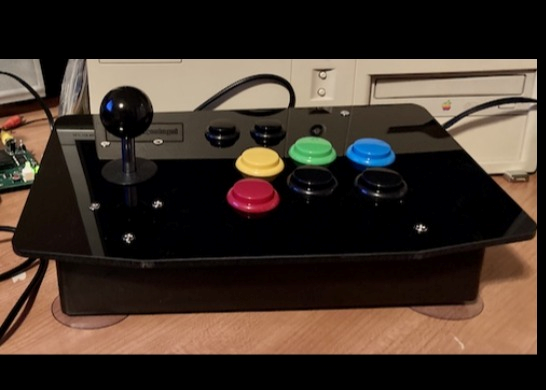
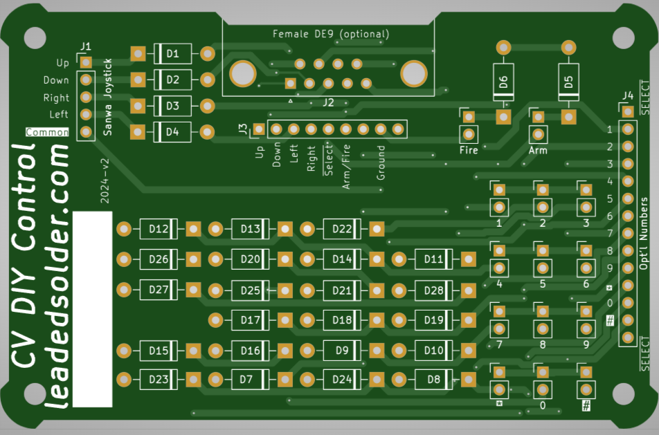

## Introduction

The stock "Hand Controller" on the ColecoVision is prone to wearing out. It is also uncomfortable to play for long periods of time, due to the position that your hand has to be placed into.

This PCB allows you to use a generic "arcade joystick kit" to build an arcade-style joystick for the ColecoVision. It makes it much easier to play.

## Support
If you liked this joystick, please [consider supporting my Patreon](https://www.patreon.com/leadedsolder) or [buying me a ko-fi](https://ko-fi.com/leadedsolder). Every penny goes back into making more free and open-source hardware for old computers and game systems.

## Ordering the PCB
Download the Gerber files from [the Releases page](/releases) and send them to your favourite PCB manufacturer.

You can also [order the PCB from PCBWay directly](https://www.pcbway.com/project/shareproject/ColecoVision_DIY_arcade_joystick_PCB_e30ae2ff.html); I will receive a small cut of this price.

## Bill of Materials

| Part                   | Quantity | Comment |
|------------------------|----------|---------|
| 1n5817 Schottky diode  | 28       | You can also use 1n4148, which is cheaper |
| A-DF 09 A/KG-T2S male DE9 | 1     | For use with a Sega extension cable.      |
| 0.1" male pin headers  | At least 40 | |

## Required Joystick Parts

In addition to the parts listed in the bill of materials, you will need to make sure that your joystick kit comes with buttons, and a Sanwa-style joystick.

The number pad can either be wired to individual buttons (I recommend wiring "1" and "*" at the very least) but some number pads will come with a multi-pin connector, which can then use the large connector on the side.

The female DE9 connector is meant to be used with a Sega Genesis controller extension cable, which is available on many sites like eBay and AliExpress. This will provide the correct pinout to the ColecoVision without having to do any messy cable-building, and you can keep the male end of the cable inside the joystick housing.

You can also wire your own cable into the 9-pin header in the middle of the board.

## Assembly

Break up your pin headers and solder them into the 2-pin connectors for number pad, ARM and FIRE buttons, and the joystick.

Fill every diode space with diodes. If you can't find 1n5817 Schottky diodes, it is OK to use the much more common (and cheaper) 1n4148.

Now it's time to assemble the joystick: put the case together according to the instructions that came with your joystick kit. Once that's done, remove the lid and install the PCB.

Check your joystick's connector. You may need to use a continuity test on your multimeter to figure out which pin is ground and which pins correspond to the directional microswitches. Make sure to install the stick the same way that the label on the board indicates.

Buttons can be connected to the 2-pin pin headers in either orientation: they are not polarized.

## Testing

The best game to test this joystick with is Frenzy, because it has some challenging diagonal directions in order to aim and fire around corners.
